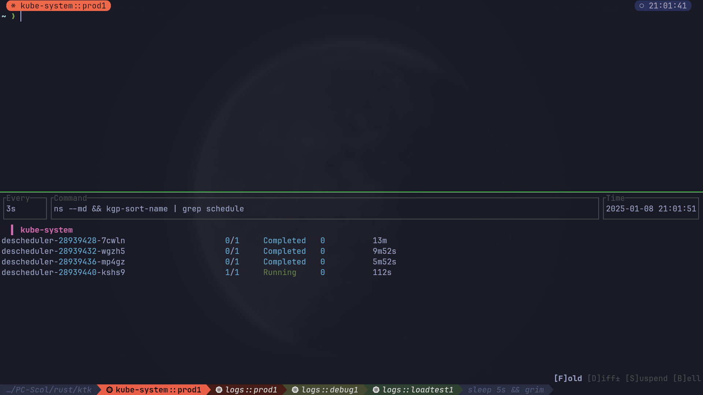
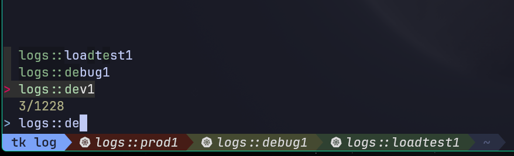

<figure>

</figure>

`ktk` is a command line tool to use many kubeconfig files
simultaneously in different terminal tabs.

Originally written for `kitty`, `ktk` can also be used to manage `tmux` and `wezterm` tabs.

It is possible to customize the name and the color of the tabs for each
cluster, to search quickly in thousands of namespaces, with a cache
file.

When `ktk` open a new tab, you go directly to a working directory
specific to the cluster and the namespace.

`ktk` can easily manage dozens of clusters with thousands of namespaces.

<figure>

<figcaption>Example of the use of kitty tabs</figcaption>
</figure>

<figure>

<figcaption>Fuzzy search in <code>ktk</code></figcaption>
</figure>

# Prerequisites

`ktk` needs `kubectl` and a terminal multiplexor like [kitty](https://sw.kovidgoyal.net/kitty/),
[wezterm](https://wezfurlong.org/wezterm/) or [tmux](https://github.com/tmux/tmux)
to work. And of course one or more Kubernetes clusters to manage.

# Install

Copy the `config.sample.yaml` configuration file to the
`~/.config/ktk.yaml` file

Customize the file to declare your Kubernetes clusters.

Add the option `allow_remote_control yes` in the configuration file
`kitty.conf`

And launch `kitty` with the `-1` option to have only one kitty instance.

## Configuration file `~/.config/ktk.yaml`

### Global section

In this section we declare the global settings of the application.

```yaml
global:
  kubetmp: "/run/user/1000/.kubeconfig"
  separator: "::"
  completion:
    file: "/home/user/.kube/tkcompleted"
    maxage: 43200
  tabprefix: "☸>>"
  gradient:
    name: Spectral
    reverse: false
    darken: true
  oh-my-posh:
    file: "/home/user/.config/oh-my-posh/theme.json"
```

- `kubetmp`: folder where temporary kubeconfig files are copied.
- `separator`: separation between namespace and cluster name in the
  cache file and in the search.
- `completion`:
  - `file`: name of the cache file for the namespace search.
  - `maxage`: Duration of cache validity in seconds.
- `tabprefix`: prefix in the tab name, e.g. `☸>>kube-system::prod`.
- `gradient`:
  - `name`: choose your gradient colors from [Colorous](https://crates.io/crates/colorous).
  - `reverse`: reverse color gradient.
  - `darken`: if true, darkens the color of the inactive tab, otherwise inverts the color.- oh-my-posh: (optional).
  - `file`: oh-my-posh configuration file path.

### Common settings for clusters

To avoid re-entering identical information for each cluster, it is
possible to use the anchor system of the yaml file.

```yaml
.workdir: &workdir
  path: "/home/user/kubernetes/deploy"
  subdir: "."
  prefixns: ""

.kubeconfig: &kubeconfig
  path: "/home/user/.kube/konfigs"
  file: "default"
```

- `workdir`: working folder when working in a namespace.
- `path`: main path.
- `subdir`: namespace specific path.
- `prefix`: prefix to remove from the namespace name. Example: `prod-`
    for a namespace like prod-my-app. So the path will be
    `/home/user/kubernetes/deploy/my-app` and not
    `/home/user/kubernetes/deploy/prod-my-app`.
- `kubeconfig`:
  - `path`: folder containing the kubeconfig file of the cluster.
  - `file`: name of the kubeconfig file.

### Clusters section

Here are the specific settings for each cluster.

```yaml
clusters:
  - name: prod
    workdir:
      <<: *workdir
      subdir: "prod_conf"
    kubeconfig:
      <<: *kubeconfig
      file: "prod"
```

## Changing bashrc or zshrc

It is not possible to change the directory from an executable, so the
program will display the export and cd commands which will be evaluated
by eval.


```bash
if kubedir=$(~/.local/bin/ktk --evaldir); then
  eval "$(echo $kubedir)"
  source <(kubectl completion zsh)
  source <(stern --completion zsh)
  # ...
else
  export KUBECONFIG=/dev/null
fi
source <(ktk completion zsh)
```
Here I take the opportunity to load the automatic completion tools only
if necessary.

```bash
[ ~/.config/ktk.yaml -nt ~/.config/oh-my-posh/theme.json ] && ktk -O
```
Since `ktk` v0.20.0, automatic update of oh-my-posh theme with `ktk`.

# Usage

```
ktk 0.20.0
Kitty Tab for Kubeconfig

Usage: ktk [OPTIONS] [namespace::cluster]

Arguments:
  [namespace]  Namespace to operate on

Options:
  -c, --config <FILE>            Sets a custom config file [default: /home/gauthier/.config/ktk.yaml]
  -f, --force                    Force reconstruct cache of namespace
  -n, --noscan                   Do not reconstruct cache of namespace
  -C, --cluster                  Search only in current cluster like kubens (alias kubens="ktk -t -C")
  -l, --list-clusters-colors     List kube clusters with tabs colors in config file
  -L, --list-clusters-names      List kube clusters names in config file
  -O, --oh-my-posh-json          Update oh-my-posh json config file
  -s, --subfilter <subfilter>    Pre-filter on a subset of value with a regexp.
  -w, --wait                     disable timeout for namespaces search
  -t, --tab                      Change namespace without change tab (like kubens)
  -d, --debug                    Record debug event in log file
  -e, --evaldir                  Show in stdout workdir of current cluster
      --completion <completion>  Output shell completion code for the specified shell [possible values: bash, elvish, fish, powershell, zsh]
  -h, --help                     Print help (see more with '--help')
  -V, --version                  Print version

Examples:
  $ ktk kube-system::production
  $ ktk -t -C kube-system
```

To open a new tab with the prod cluster context for the default
namespace :

    # ktk default::prod

A new tab with the name `☸>>default::prod` is opened with the correct
kubeconfig context. If the command is run again, the focus will be on
the tab that already has the same name.

The first time the command is run, `ktk` will scan all the clusters to
get the list of namespaces and store this information in the cache.

To force the expiration of the cache (which by default lasts maxage
seconds), especially when I have just created a new namespace, I just
have to choose the `-f` option like this:

    # ktk -f new-namespace::prod

If the name of the namespace is not complete, `ktk` opens a dialog to
ask to choose in the list of possible namespaces, the one you want to
reach.

```
  test5::prod
  temp-stage-ns::dev
> test1-namespace::sandbox
 3/32
> test
```

# Special features

Due of the difference between `kitty`, `wezterm` and `tmux`, the behaviour
of `ktk` differs between these 3 tools.

## Tmux

Tmux does not support multiple tab coloring.
Configuring the gradient color of the tabs in the config file has no effect.

## Wezterm

### Themes

Unlike `kitty`, it's not possible with `wezterm` to pass tab colors as parameters, but it is possible to read the `ktk` configuration file directly and create the color palette to be applied to tabs based on the Kubernetes context name.

```lua
local function get_cluster_ktk()
	local clusters = {}
	local file = io.open(wezterm.home_dir .. "/.config/ktk.yaml", "r")
	if file == nil then
		return
	end
	local content = file:read("*all")
	file:close()

	local data = wezterm.serde.yaml_decode(content)
	for _, v in pairs(data.clusters) do
		table.insert(clusters, v.name)
	end
	return clusters
end

local function get_gradient_ktk()
	local file = io.open(wezterm.home_dir .. "/.config/ktk.yaml", "r")
	if file == nil then
		return
	end
	local content = file:read("*all")
	file:close()

	local data = wezterm.serde.yaml_decode(content)
	return data.global.gradient.name
end

local clusters_kube = get_cluster_ktk()
local gradient_colors = wezterm.color.gradient({ preset = get_gradient_ktk() }, #clusters_kube)
```

The result is a color chart of the size of the number of clusters.

### Workspaces

`ktk` manages `wezterm` workspaces as independent environments. It is possible to open a tab with an identical Kubernetes context (same namespace and same cluster) in 2 different workspaces.
